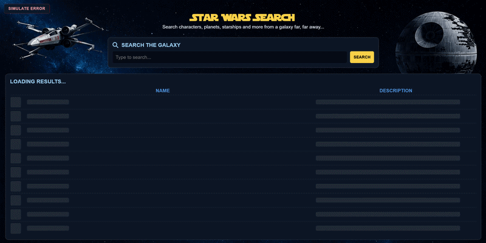
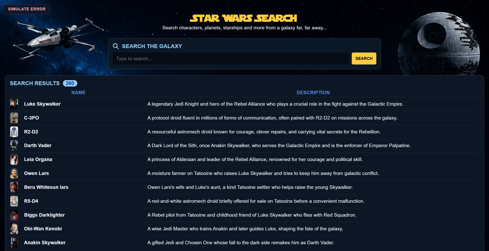
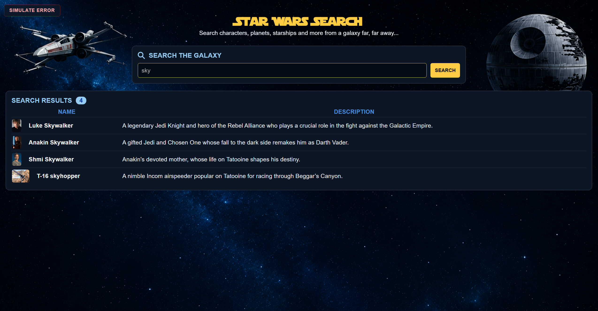
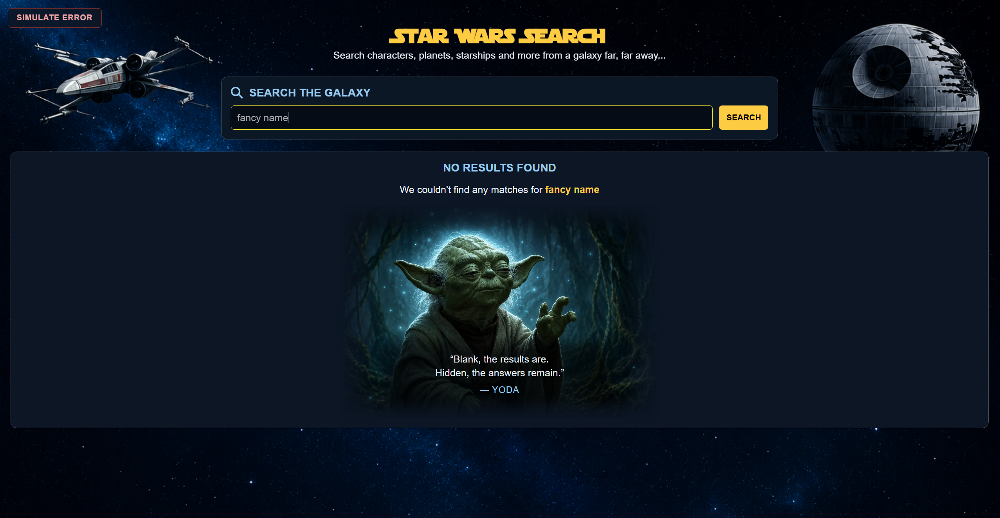
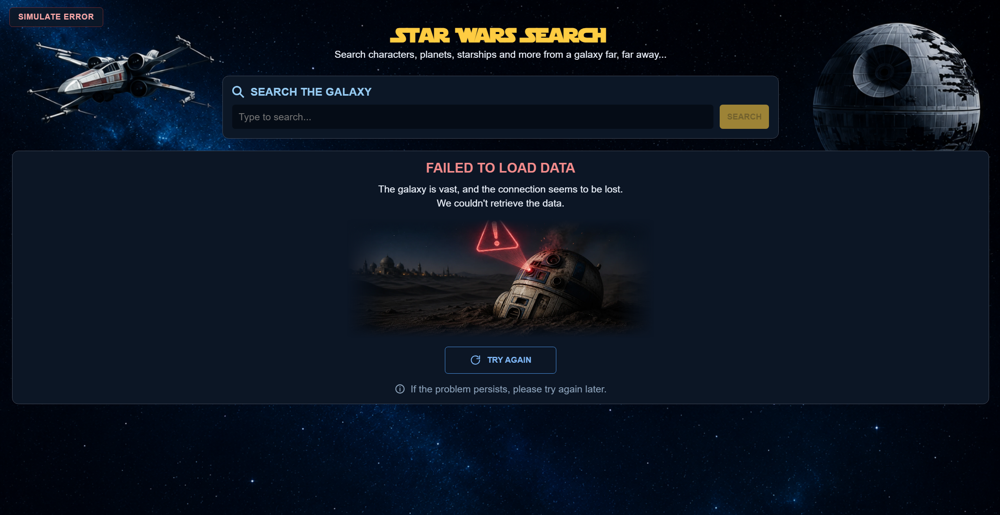
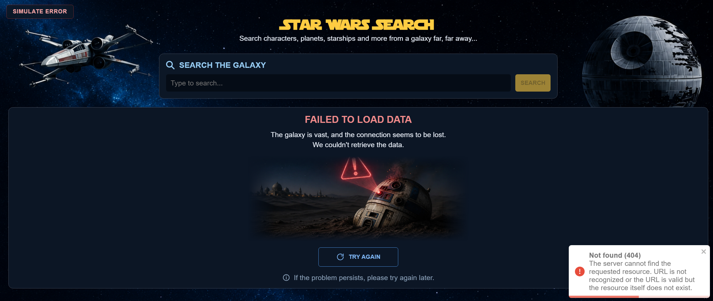
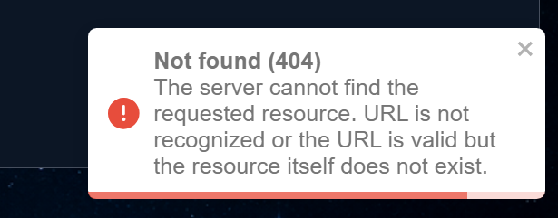
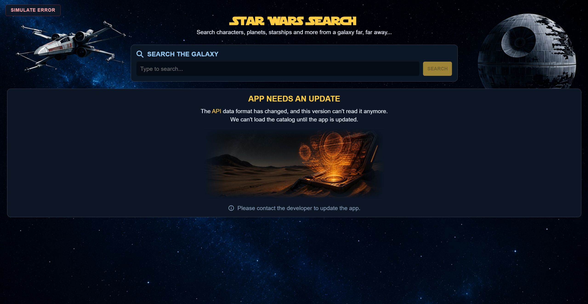
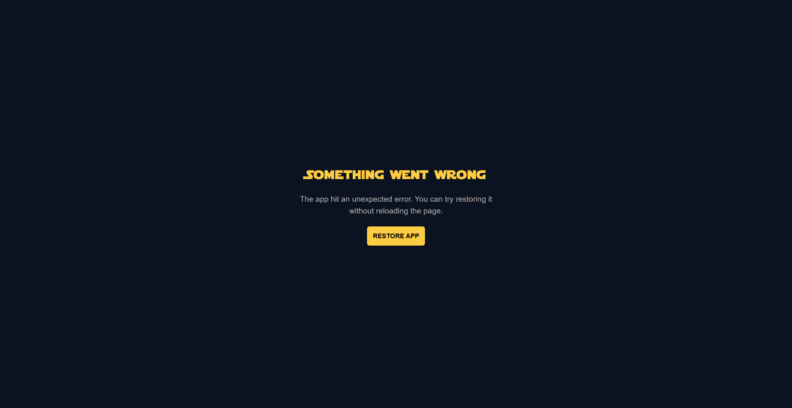

## About the app

Star Wars Search is a catalog for characters, species, planets, starships, vehicles, and films. You type a name and get matches (or a no-results screen). The last query comes back after a reload.

Data comes from [swapi.info](https://swapi.info). The app loads all six categories once, adds a description to each item, and caches the catalog in `localStorage`. After that, search is a local filter — no request per query.

HTTP errors show a toast. A failed fetch, a changed API shape, and an unexpected crash each have their own screen.

## Screens

Loading screen

All results

Found results

No results

Failed to load

HTTP error toast (full screen)

HTTP error toast

API changed

Unexpected app crash

